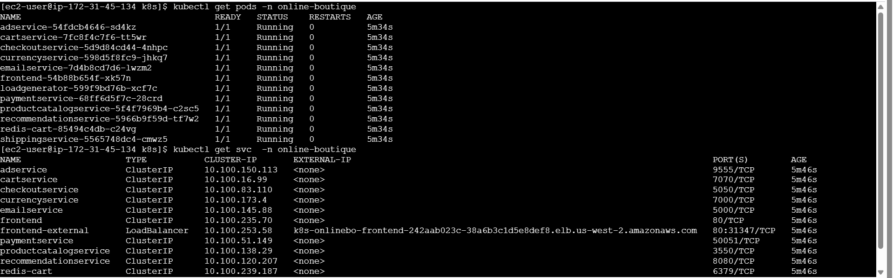
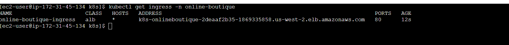
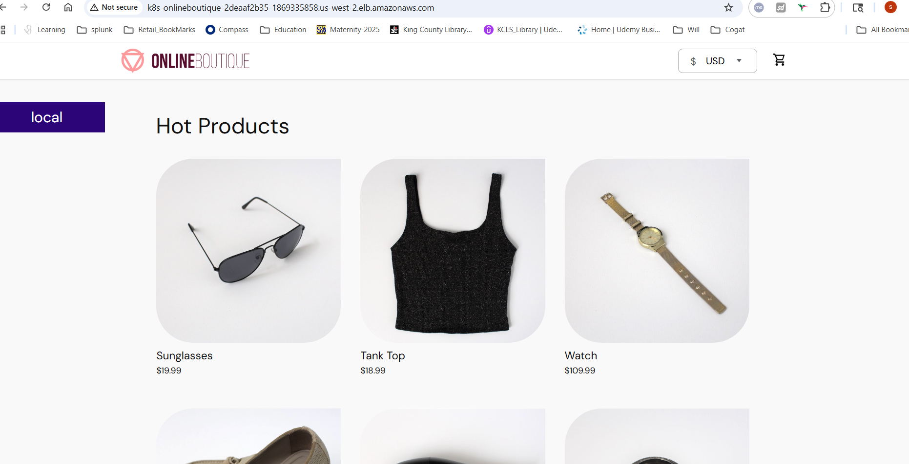

# Online Boutique on EKS with Ingress

This repo is my demo of the **Google Online Boutique** app running on **Amazon EKS**.  
I used **Kubernetes manifests + Helm**, and also tried **Ingress with ALB**.

## What is inside
- `k8s/` → all YAML files (namespace, ingress, manifests)  
- `helm/` → Helm chart and values  
- `docs/` → some notes and screenshots  
- `scripts/` → extra commands (optional)  

## How I ran it
1. First I created a namespace:
   kubectl apply -f k8s/namespace.yaml

2. Then I applied the manifests:
  kubectl apply -f k8s/kubernetes-manifests.yaml

3. Finally I added ingress:
kubectl apply -f k8s/online-boutique-ingress.yaml

## How I checked
kubectl get pods -n <namespace>
kubectl get svc -n <namespace>

## Notes
This was just for practice and learning Ingress on EKS (region: us-west-2)

## Screenshots

- Pods & Services running:  
  

- Ingress and URL:  
  

- Online Boutique UI:  
  

(For more detailed logs and command outputs, see [docs/Screenshots/](docs/Screenshots/))

